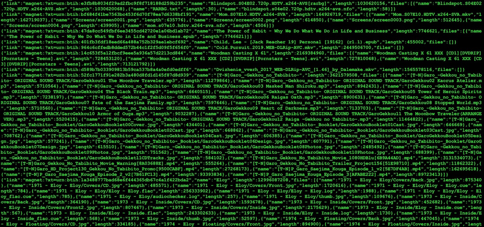

btsniffer
======================================


## Introduction
btsniffer is a used rust written torrent sniffer. it sniffs torrents from BitTorrent network.




## Usage

```
$ ./btsniffer -h
btsniffer 0.1.0

USAGE:
    btsniffer [OPTIONS]

FLAGS:
    -h, --help       Prints help information
    -V, --version    Prints version information

OPTIONS:
    -a, --addr <addr>           listen on given address (default all, ipv4 and ipv6) [default: 0.0.0.0]
    -b, --blacklist <blsize>    max blacklist size for downloading torrents [default: 5000]
    -d, --dir <dir>             the directory to store the torrents [default: ./torrents/]
    -f, --friends <friends>     max fiends to make with per second [default: 500]
    -e, --peers <peers>         max peers to connect to download torrents [default: 500]
    -p, --port <port>           listen on given port [default: 6881]
    -t, --timeout <timeout>     max time allowed for downloading torrents [default: 15]
```


## Quick start
Use default flags:

`./btsniffer`


## Protocols

* The BitTorrent Protocol Specification *
http://www.bittorrent.org/beps/bep_0003.html

* DHT Protocol *
http://www.bittorrent.org/beps/bep_0005.html

* Extension for Peers to Send Metadata Files *
http://www.bittorrent.org/beps/bep_0009.html

* Extension Protocol *
http://www.bittorrent.org/beps/bep_0010.html

